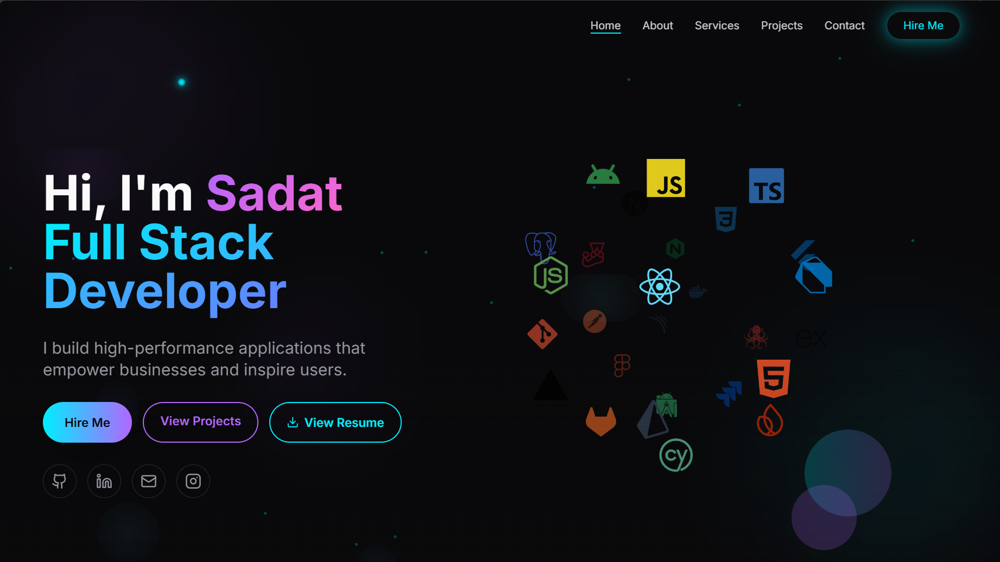

<div align="center">
  <br />
    <a>
      
    </a>
  <br />

  <div>
    
    
    
  </div>

  <h3 align="center">Welcome to my portfolio – a place where I showcase my skills, projects, and journey as a Full-Stack Developer.</h3>
</div>

## 📋 <a name="table">Table of Contents</a>

1. 🤖 [Introduction](#introduction)
2. ⚙️ [Tech Stack](#tech-stack)
3. 🔋 [Features](#features)
4. 🤸 [Quick Start](#quick-start)


## <a name="introduction">🤖 Introduction</a>

Hi, I’m Sadat Ali, a passionate Full-Stack Web Developer and CSE Student 🎓.
This portfolio serves as a central hub for:

Showcasing my projects 💻

Sharing my skills & experience 📚

Highlighting my tech journey 🚀

Whether it’s frontend creativity or backend logic, this portfolio reflects my love for technology and innovation.

## <a name="tech-stack">💻 Tech Stack</a>

- TypeScript.js
- Three.js
- Vite
- Tailwind CSS
- GSAP
- Locomotive Scroll
- shadcn/ui

## <a name="features">🔋 Features</a>

👉 **Customizable 3D Hero Section**: Includes a 3D desktop model easily customizable to suit specific needs.

👉 **Interactive Experience and Work Sections**: Utilizes animations powered by framer motion for engaging user experience.

👉 **3D Skills Section**: Showcases skills using 3D geometries through three.js and React Three fiber

👉 **Animated Projects and Testimonials**: Features animated sections using framer motion for projects and client testimonials.

👉 **Contact Section with 3D Earth Model**:Integrates a 3D earth model with email functionality powered by emailjs.

👉 **Consistent Animations**: Implements cohesive animations throughout the website using framer motion.

👉 **Responsive Design**: Ensures optimal display and functionality across all devices.

and many more, including code architecture and reusability 

## <a name="quick-start">🤸 Quick Start</a>

Follow these steps to set up the project locally on your machine.

**Prerequisites**

Make sure you have the following installed on your machine:

- [Git](https://git-scm.com/)
- [Node.js](https://nodejs.org/en)
- [npm](https://www.npmjs.com/) (Node Package Manager)

**Cloning the Repository**

```bash
git clone https://github.com/sadatali123/sadat.dvlpr.git
cd sadat.dvlpr
```

**Installation**

Install the project dependencies using npm:

```bash
npm install
```

**Running the Project**

```bash
npm run dev
```

Open [http://localhost:5173](http://localhost:5173) in your browser to view the project.


<!-- ## <a name="links">🔗 Links</a>

Models and Assets used in the project can be found [here](https://drive.google.com/) -->


🔗 Demo & Screenshots

🌍 Live Portfolio: <a href="#">My Portfolio Website <i class="ri-arrow-right-up-line"></i>
<a/>


📸 Screenshots

Home Page → 

About Page → 

Project Page → 

Contact Page → 

<br/>
📜 License

This project is licensed under the MIT License.